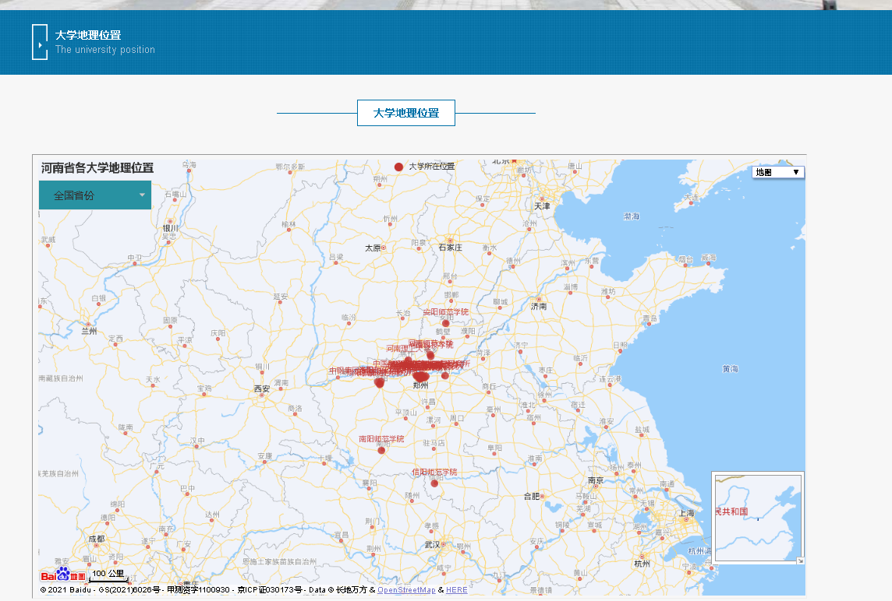

# 计算机毕业设计之大数据机器学Python+SpringBoot考研分数分析与预测系统 大数据毕业设计 考研大数据分析 考研大数据预测 考研数据分析 KNN算法 人工智能

## 要求
### 源码有偿！一套(论文 PPT 源码+sql脚本)

https://www.bilibili.com/video/BV1aq4y1m7U3?spm_id_from=333.999.0.0

### 

### 加好友前帮忙start一下，并备注github有偿获取源码
### 我的QQ号是2877135669 或者 1679232425
### 加qq好友说明（被部分 网友整得心力交瘁）：
    1.加好友务必按照格式备注
    2.避免浪费各自的时间！
    3.当“客服”不容易，repo 主是体面人，不爆粗，性格好，文明人。

## 特色

预测算法、KNN、机器学习、数据爬虫、可视化

## 创新点

（1）将数据分析与预测相结合；

（2）采用数据可视化技术，简洁高效的将数据展示给用户，提升用户体验；

（3）有效Python采集多个地区、多所大学的相关考研信息；

（4）系统采用人机交互的方式，界面设计美观友好，信息查询灵活、方便迅速；

（5）结合百度地图api展示大学地理位置信息；

（6）能够准确、详细、直观地展示各个院校各个专业分数线等信息；

（7）采用多种预测算法，尽可能的提升预测的精准度(Python:KNN等算法)；

（8）系统应最大限度地实现易维护性和易操作性；

## 开发技术

前端开发：html、echarts、ajax

后端开发：springboot+mybatis

算法开发：Python、KNN算法、机器学习、深度学习、模型等

数据库：MySQL

## 运行截图

# 运行视频(B站)

https://www.bilibili.com/video/BV1aq4y1m7U3?spm_id_from=333.999.0.0

